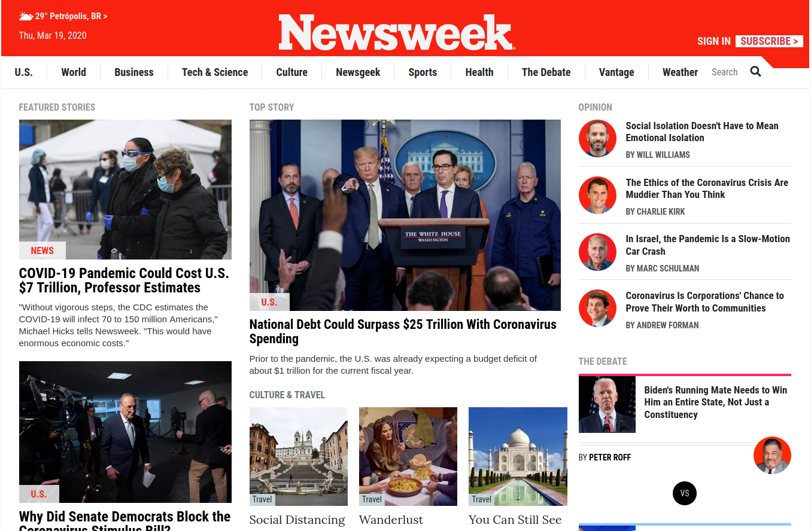

# Building With Backgrounds and Gradients

>This project consists of building a mockup of the Newsweek magazine home page using Bootstrap 4.0. Special attention was given to using the responsive capabilities of Bootstrap 4 and its components.

You can find the original project page: (https://www.newsweek.com/)

## Built With

- CSS Flex,
- HMTL,
- Bootstrap 4.

## Live Demo

Here's a link to github pages if you need to see a preview, but be aware that github pages is not displaying any of the icons added with Font Awesome. I don't know why. Thanks! 

[Live Demo Link](https://guirecordon.github.io/bootstrap-newsweek-mockup/)

## Authors

👤 **Guilherme Recordon**

- Github: [@guirecordon](https://github.com/guirecordon)
- Twitter: [@RecordonG](https://twitter.com/RecordonG)
- Linkedin: [Guilherme Recordon](https://linkedin.com/gui-recordon-marketingmba/)

## 🤝 Contributing

Contributions, issues and feature requests are welcome!

Feel free to check the [issues page](https://github.com/guirecordon/bootstrap-newsweek-mockup/issues).

## Show your support

Give a ⭐️ if you like this project!

## Acknowledgments

A shout-out to my Stand-Up team members Sunday (@ezeilo-su), Brenda (@bren2102) and Dan (@dansantander) for their tips and encouragement! 
